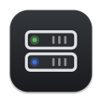
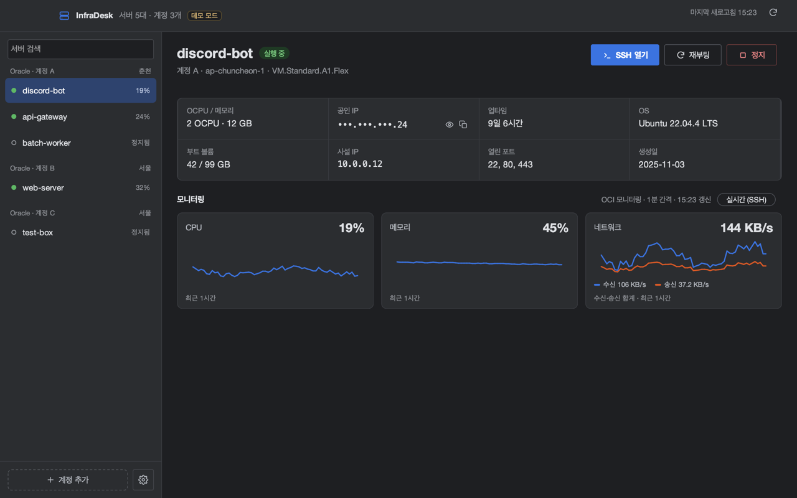
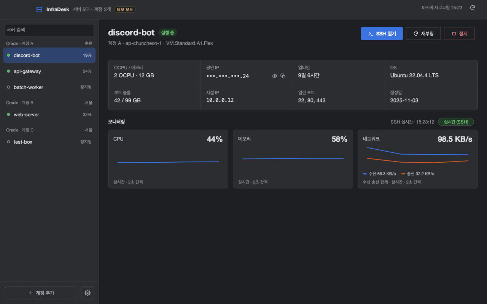
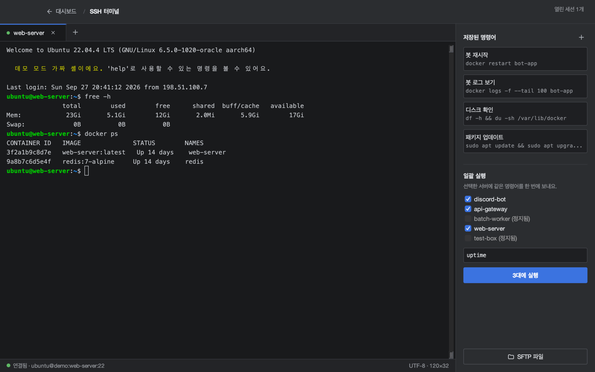
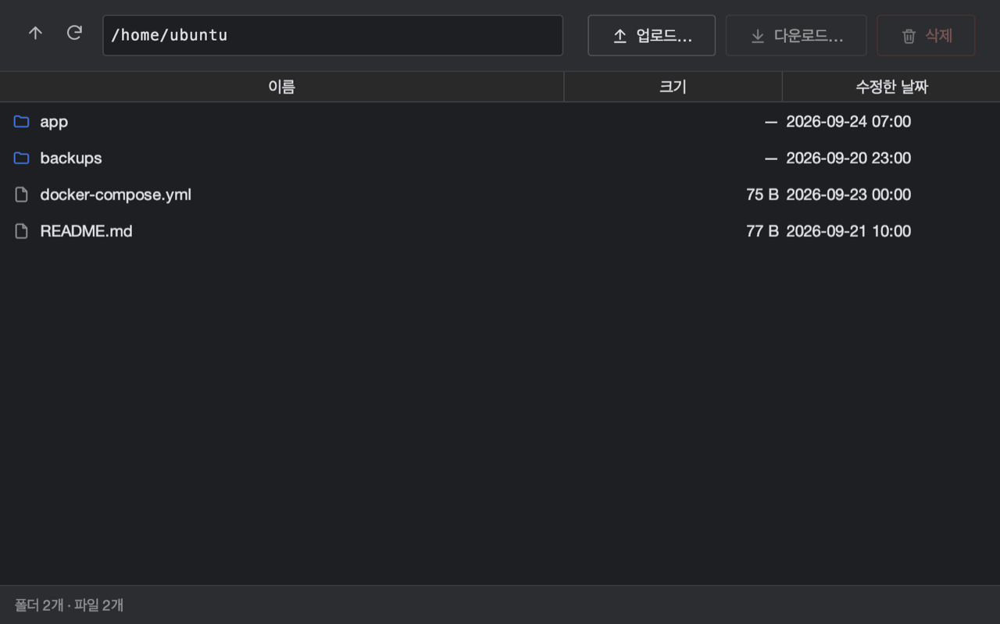
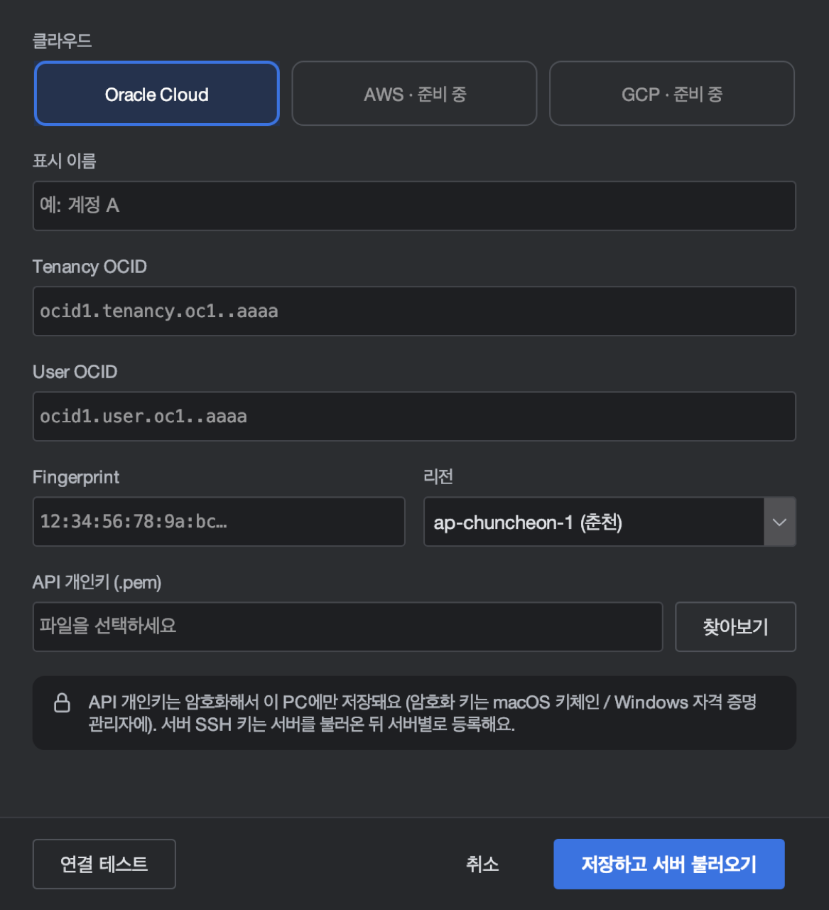

<p align="center">
  
</p>

<h1 align="center">InfraDesk</h1>

<p align="center">
  여러 클라우드 계정의 서버를 한 곳에서 — 상태 모니터링, 전원 제어, SSH 터미널<br>
  macOS · Windows 데스크톱 앱 (현재 Oracle Cloud 지원)
</p>

<p align="center">
  <a href="https://github.com/kimdongwoo0930/infra-desk/releases/tag/beta"><b>⬇ 베타 다운로드</b></a> ·
  <a href="#처음-설정">처음 설정</a> ·
  <a href="#데모-모드">데모 모드</a> ·
  <a href="docs/ARCHITECTURE.md">구조</a>
</p>



## 주요 기능

- **계정 여러 개를 한 화면에** — OCI 계정(테넌시)마다 API 키를 등록하면 서버를 자동으로 불러와 계정별로 보여줘요.
- **상태와 제어** — 실행 중 / 정지 / 변경 중 상태를 자동 새로고침(평소 45초, 시작·정지 직후 5초)으로 보여주고, 시작·정지·재부팅은 확인 후 실행해요.
- **모니터링** — CPU·메모리·네트워크 최근 1시간 그래프(OCI Monitoring), SSH로 2초마다 읽는 실시간 모드.
- **SSH 터미널** — 서버별 탭, 저장된 명령어, 여러 서버에 한 번에 명령 실행, SFTP 파일 탐색기. `~/.ssh/config`에서 사용자·키를 자동으로 가져와요.
- **서버 정보** — 업타임, OS, 디스크 사용량, 열린 포트(SSH로 확인).
- **메뉴 막대 아이콘** — 창을 닫아도 메뉴 막대에서 서버 상태를 보고 바로 제어할 수 있어요. 로그인할 때 자동 실행도 가능.
- **디스코드 알림** — 서버가 예상치 않게 멈추거나, 계정 연결이 끊기거나, CPU가 높게 유지될 때.
- **안전하게** — 키·비밀번호는 암호화해서 이 PC에만 저장, 공인 IP는 기본으로 가려서 표시, 로그에서도 비밀값을 가려요.

| 모니터링 · 실시간 | SSH 터미널 |
|---|---|
|  |  |
| **SFTP 파일** | **계정 추가** |
|  |  |

> 스크린샷은 모두 [데모 모드](#데모-모드)의 가짜 데이터예요.

## 다운로드 (베타)

`main`에 변경이 올라올 때마다 자동으로 빌드되어 [Beta 릴리스](https://github.com/kimdongwoo0930/infra-desk/releases/tag/beta)에 올라가요. 앱이 새 빌드를 알아서 확인하고 메뉴 막대에 알려줘요.

| OS | 파일 |
|---|---|
| macOS (Apple Silicon · Intel) | [InfraDesk-beta-macOS.dmg](https://github.com/kimdongwoo0930/infra-desk/releases/download/beta/InfraDesk-beta-macOS.dmg) |
| Windows | [InfraDesk-beta-windows.zip](https://github.com/kimdongwoo0930/infra-desk/releases/download/beta/InfraDesk-beta-windows.zip) |

Java는 앱에 들어 있어 따로 설치할 필요가 없어요.

**macOS** — 서명·공증되지 않은 앱이라 처음 한 번 아래 명령이 필요해요.

```bash
xattr -dr com.apple.quarantine /Applications/InfraDesk.app
```

**Windows** — 압축을 풀고 `InfraDesk.exe` 실행. SmartScreen 경고가 뜨면 *추가 정보 → 실행*.

## 처음 설정

### 1. OCI API 키 만들기 (계정마다 한 번)

OCI 콘솔 → 오른쪽 위 프로필 → **내 프로필** → **API 키** → **API 키 추가** → *API 키 쌍 생성* → **개인 키 다운로드** → **추가**.
나오는 *구성 파일 미리보기*의 `tenancy`, `user`, `fingerprint`, `region` 값을 확인해 두세요.

### 2. 계정 추가

사이드바 **⊕ 계정 추가** → 값을 붙여넣고 개인 키(`.pem`) 선택 → **연결 테스트** → **저장하고 서버 불러오기**.
나중에 바꾸려면 계정 이름을 우클릭 → **계정 설정…**.

### 3. SSH 설정 (터미널·실시간·SFTP를 쓰려면)

서버 상세의 **SSH 열기**를 누르면 SSH 설정 창이 떠요. `~/.ssh/config`에 그 서버(IP)가 있으면 사용자 이름과 키가 미리 채워져요.
처음 접속할 때 호스트 키 지문을 확인하고 신뢰하면, 이후에는 키가 바뀌었을 때만 경고해요.

## 데모 모드

키 없이 가짜 계정·서버로 모든 화면을 둘러볼 수 있어요. 실제 설정·키체인·네트워크는 건드리지 않아요.

```bash
# 설치한 앱
/Applications/InfraDesk.app/Contents/MacOS/InfraDesk --demo
# 소스에서
./gradlew runDemo
```

## 보안과 데이터

| 무엇 | 어디에 |
|---|---|
| 계정 설정(OCID, 리전), SSH 사용자·포트, 저장된 명령어 | macOS `~/Library/Application Support/InfraDesk/`, Windows `%APPDATA%\InfraDesk\` (본인만 읽기) |
| API 개인키, SSH 키, 디스코드 웹훅 | 같은 폴더의 `secrets.vault` — **AES-256-GCM 암호화**. 암호화 키는 OS 키체인(macOS 키체인 / Windows 자격 증명 관리자)에만 |
| 로그 | macOS `~/Library/Logs/InfraDesk/`, Windows `%LOCALAPPDATA%\InfraDesk\logs` — 키·웹훅·공인 IP·OCID는 가려서 기록 |

- 서버 접속은 SSH만 써요. Docker 등 다른 포트를 열지 않아요.
- 처음 보는 서버의 호스트 키는 확인 후 기억하고, 바뀌면 연결을 막아요.
- 공인 IP는 화면에서 기본으로 가려져 있어요(👁 버튼으로 보기).

## 개발

Java 25가 필요해요 (Gradle은 Wrapper 포함).

```bash
./gradlew run            # 실행
./gradlew runDemo        # 데모 모드
./gradlew test           # 테스트
./gradlew snapshot       # 데모 화면을 build/snapshots/*.png로 (창 없이)
./gradlew dmg            # macOS 설치 파일 (패키징된 앱 자가 점검 포함)
./gradlew windowsZip     # Windows (Windows에서)
```

스택: Swing + FlatLaf, Apache MINA SSHD, JediTerm, OCI Java SDK, XChart, jpackage.
문서: [구조](docs/ARCHITECTURE.md) · [개발 기록](docs/DEVLOG.md) · [디자인](docs/design/DESIGN.md)

## 라이선스

[MIT](LICENSE). 포함된 오픈소스 라이브러리의 라이선스는 앱의 **설정 → 앱 정보 → 오픈소스 라이선스**에서 볼 수 있어요.
